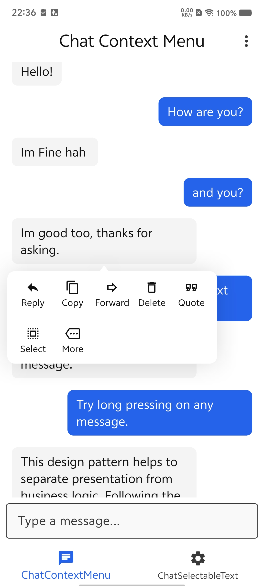
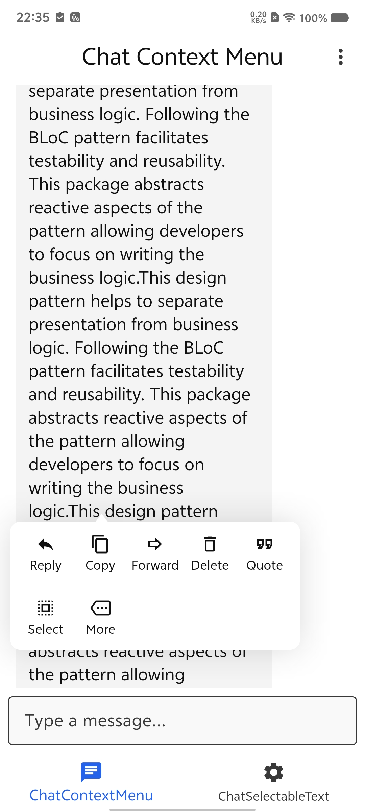

# Chat Context Menu

A Flutter package that provides an iOS-style chat context menu with customizable appearance and animations. This package handles the positioning, arrow indicator, and background blur/dimming, allowing you to provide any widget as the menu content.

## Features

*   **iOS-style Context Menu:** Smooth animations and layout similar to native iOS context menus.
*   **Automatic Positioning:** The menu is automatically positioned near the target widget, with smart overflow handling.
*   **Arrow Indicator:** An optional arrow points to the target widget.
*   **Customizable Appearance:** Configure background color, border radius, and barrier color.
*   **Flexible Content:** You provide the widget for the menu content, giving you full control over the items and layout.
*   **Easy Integration:** Wrap any widget with `ChatContextMenuWrapper` to enable the context menu.

## Screenshots

|                    ScreenShot                    |                    ScreenShot                    |
|:------------------------------------------------:|:------------------------------------------------:|
|  |  |

## Getting started

Add `chat_context_menu` to your `pubspec.yaml`:

```yaml
dependencies:
  chat_context_menu: ^last_version
```

## Usage

Wrap the widget you want to trigger the menu (usually a chat bubble) with `ChatContextMenuWrapper`.

```dart
import 'package:chat_context_menu/chat_context_menu.dart';
import 'package:example/app_theme.dart';
import 'package:example/context_menu_pane.dart';
import 'package:flutter/material.dart';

void main() {
  runApp(const MyApp());
}

class MyApp extends StatelessWidget {
  const MyApp({super.key});

  @override
  Widget build(BuildContext context) {
    return MaterialApp(
      title: 'Chat Context Menu',
      theme: AppTheme.light,
      darkTheme: AppTheme.dark,
      themeMode: .system,
      debugShowCheckedModeBanner: false,
      home: const ChatScreen(),
    );
  }
}

class ChatScreen extends StatefulWidget {
  const ChatScreen({super.key});

  @override
  State<ChatScreen> createState() => _ChatScreenState();
}

class _ChatScreenState extends State<ChatScreen> {
  final List<String> _messages = [
    "Hello!",
    "Hello!",
    "How are you?",
    "Im Fine",
    "and you?",
    "Im good too, thanks for asking.",
    "This is a long press context menu demo.",
    "Try long pressing on any message.",
    "Try long pressing on any message.",
    "You can see different options.",
    "You can see different options.",
    "Like Reply, Copy, Forward, Delete.",
    "It mimics the iOS style context menu.",
    "Hope",
    "It mimics the iOS style context menu.",
    "Hope",
    "Like Reply, Copy, Forward, Delete.",
  ];

  @override
  Widget build(BuildContext context) {
    final ThemeData theme = Theme.of(context);
    final TextTheme textTheme = theme.textTheme;
    final ColorScheme colorScheme = theme.colorScheme;

    return Scaffold(
      appBar: AppBar(title: const Text('Chat Context Menu')),
      body: Column(
        children: [
          Expanded(
            child: ListView.builder(
              padding: const EdgeInsets.all(16),
              itemCount: _messages.length,
              itemBuilder: (context, index) {
                final isMe = index % 2 == 0;
                return Padding(
                  padding: const EdgeInsets.symmetric(vertical: 4),
                  child: Align(
                    alignment: isMe
                        ? Alignment.centerRight
                        : Alignment.centerLeft,
                    child: ChatContextMenuWrapper(
                      barrierColor: Colors.transparent,
                      backgroundColor: colorScheme.surface,
                      borderRadius: BorderRadius.circular(10),
                      shadows: [
                        BoxShadow(
                          color: colorScheme.onSurface.withValues(alpha: 0.15),
                          blurRadius: 32,
                        ),
                      ],
                      menuBuilder: (context, hideMenu) {
                        return ContextMenuPane(
                          textTheme: textTheme,
                          colorScheme: colorScheme,
                          onReplayTap: hideMenu,
                          onForwardTap: hideMenu,
                          onCopyTap: hideMenu,
                          onDeleteTap: hideMenu,
                          onMoreTap: hideMenu,
                          onQuoteTap: hideMenu,
                          onSelectTap: hideMenu,
                        );
                      },
                      widgetBuilder: (context, showMenu) {
                        return GestureDetector(
                          onLongPress: showMenu,
                          child: Container(
                            padding: const EdgeInsets.symmetric(
                              horizontal: 12,
                              vertical: 8,
                            ),
                            margin: .symmetric(vertical: 4),
                            decoration: BoxDecoration(
                              color: isMe
                                  ? colorScheme.primary
                                  : colorScheme.surfaceContainerHighest,
                              borderRadius: BorderRadius.circular(8),
                            ),
                            child: Text(
                              _messages[index],
                              style: TextStyle(
                                fontSize: 16,
                                color: isMe ? colorScheme.onPrimary : null,
                              ),
                            ),
                          ),
                        );
                      },
                    ),
                  ),
                );
              },
            ),
          ),
          Padding(
            padding: const EdgeInsets.all(8.0),
            child: TextField(
              decoration: const InputDecoration(
                hintText: 'Type a message...',
                border: OutlineInputBorder(),
              ),
            ),
          ),
        ],
      ),
      bottomNavigationBar: BottomNavigationBar(
        items: const [
          BottomNavigationBarItem(icon: Icon(Icons.chat), label: 'Chat'),
          BottomNavigationBarItem(
            icon: Icon(Icons.settings),
            label: 'Settings',
          ),
        ],
      ),
    );
  }
}


```

## Customization

You can customize the `ChatContextMenuWrapper` with the following properties:

*   `menuBuilder`: A builder function that returns the widget to display in the menu. It provides a `hideMenu` callback.
*   `barrierColor`: Color of the background overlay.
*   `backgroundColor`: Background color of the menu container.
*   `borderRadius`: Border radius of the menu container.
*   `padding`: Padding inside the menu container.

## Additional information

For more details, check the `example` folder in the repository.

