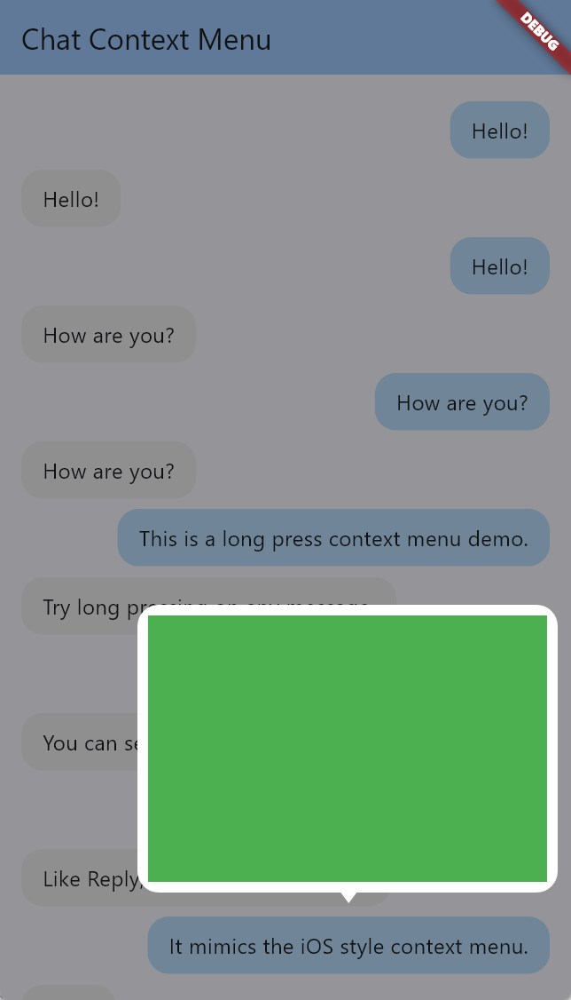
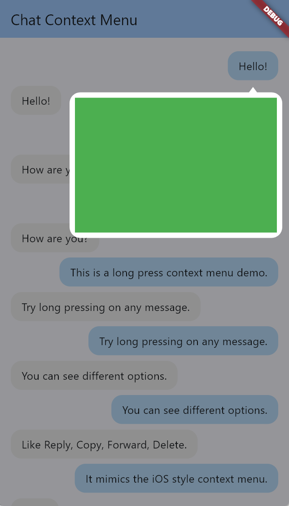

# Chat Context Menu
For more details, check the `example` folder in the repository.

|  |  |
|---------------------------------------------------------------------|-----------------------------------------------------------------------|

## Additional information

*   `runSpacing`: Vertical spacing between lines of items.
*   `spacing`: Horizontal spacing between items (if wrapped).
*   `borderRadius`: Border radius of the menu container.
*   `foregroundColor`: Default color for text and icons (can be overridden in items).
*   `backgroundColor`: Background color of the menu.
*   `barrierColor`: Color of the background overlay.
*   `menuItems`: List of `ChatContextMenuItem` to display.

You can customize the `ChatContextMenuWrapper` with the following properties:
