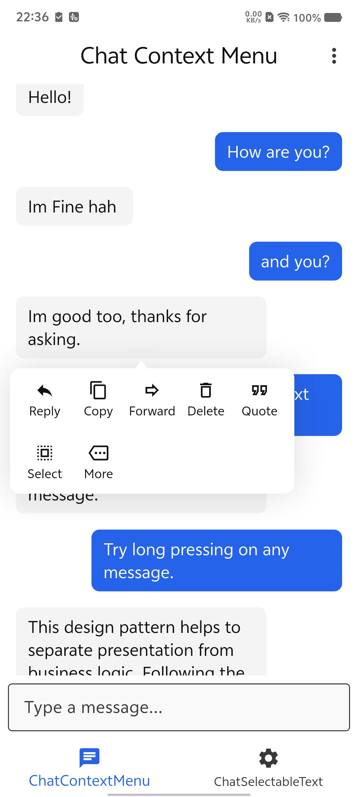
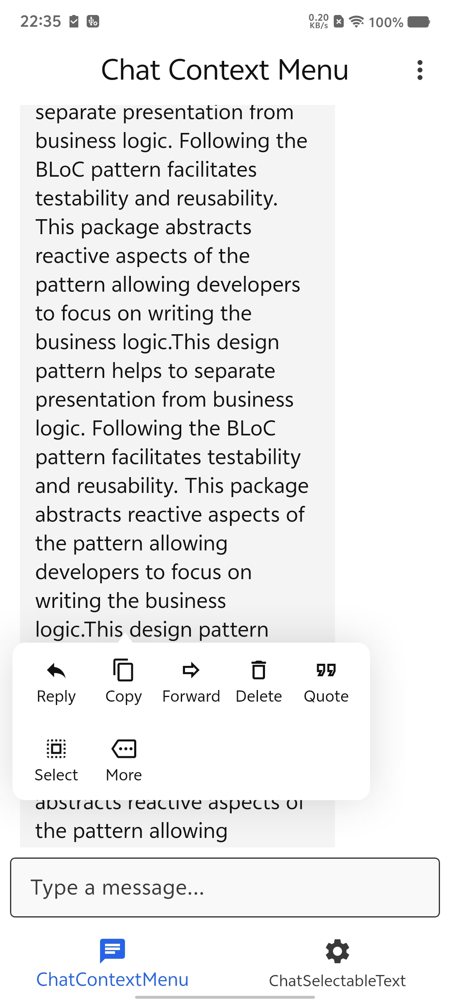
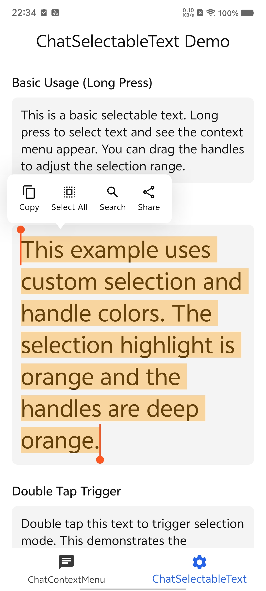

# Chat Context Menu

一个提供 iOS 风格聊天上下文菜单的 Flutter 组件包，支持自定义外观和动画。该组件包处理菜单定位、箭头指示器和背景遮罩，你只需提供任意 Widget 作为菜单内容。

## 功能特性

*   **iOS 风格上下文菜单：** 流畅的动画和布局，类似原生 iOS 上下文菜单。
*   **自动定位：** 菜单自动定位在目标组件附近，智能处理溢出情况。
*   **箭头指示器：** 可选的箭头指向目标组件。
*   **自定义外观：** 可配置背景颜色、圆角和遮罩颜色。
*   **灵活的内容：** 你提供菜单内容的 Widget，完全控制菜单项和布局。
*   **简单集成：** 使用 `ChatContextMenuWrapper` 包裹任意组件即可启用上下文菜单。
*   **可选文本：** `ChatSelectableText` 提供完全自定义的文本选择，支持拖动手柄、自动滚动和智能定位的上下文菜单，非常适合聊天气泡。
*   **平台自适应触发：** `ChatContextMenuWrapper` 可配置移动端（单击 / 双击 / 长按）和桌面端（右键 / 左键）的触发方式。

## 截图

|                    ScreenShot                    |                    ScreenShot                    |         ScreenShot                    ｜          |
|:------------------------------------------------:|:------------------------------------------------:|:------------------------------------------------:|
|  |  |  |

## 开始使用

在 `pubspec.yaml` 中添加 `chat_context_menu`：

```yaml
dependencies:
  chat_context_menu: ^last_version
```

## 用法

使用 `ChatContextMenuWrapper` 包裹你想触发菜单的组件（通常是聊天气泡）。

```dart
import 'package:chat_context_menu/chat_context_menu.dart';
import 'package:example/app_theme.dart';
import 'package:example/context_menu_pane.dart';
import 'package:flutter/material.dart';

void main() {
  runApp(const MyApp());
}

class MyApp extends StatelessWidget {
  const MyApp({super.key});

  @override
  Widget build(BuildContext context) {
    return MaterialApp(
      title: 'Chat Context Menu',
      theme: AppTheme.light,
      darkTheme: AppTheme.dark,
      themeMode: .system,
      debugShowCheckedModeBanner: false,
      home: const ChatScreen(),
    );
  }
}

class ChatScreen extends StatefulWidget {
  const ChatScreen({super.key});

  @override
  State<ChatScreen> createState() => _ChatScreenState();
}

class _ChatScreenState extends State<ChatScreen> {
  final List<String> _messages = [
    "Hello!",
    "Hello!",
    "How are you?",
    "Im Fine",
    "and you?",
    "Im good too, thanks for asking.",
    "This is a long press context menu demo.",
    "Try long pressing on any message.",
    "Try long pressing on any message.",
    "You can see different options.",
    "You can see different options.",
    "Like Reply, Copy, Forward, Delete.",
    "It mimics the iOS style context menu.",
    "Hope",
    "It mimics the iOS style context menu.",
    "Hope",
    "Like Reply, Copy, Forward, Delete.",
  ];

  @override
  Widget build(BuildContext context) {
    final ThemeData theme = Theme.of(context);
    final TextTheme textTheme = theme.textTheme;
    final ColorScheme colorScheme = theme.colorScheme;

    return Scaffold(
      appBar: AppBar(title: const Text('Chat Context Menu')),
      body: Column(
        children: [
          Expanded(
            child: ListView.builder(
              padding: const EdgeInsets.all(16),
              itemCount: _messages.length,
              itemBuilder: (context, index) {
                final isMe = index % 2 == 0;
                return Padding(
                  padding: const EdgeInsets.symmetric(vertical: 4),
                  child: Align(
                    alignment: isMe
                        ? Alignment.centerRight
                        : Alignment.centerLeft,
                    child: ChatContextMenuWrapper(
                      barrierColor: Colors.transparent,
                      backgroundColor: colorScheme.surface,
                      borderRadius: BorderRadius.circular(10),
                      shadows: [
                        BoxShadow(
                          color: colorScheme.onSurface.withValues(alpha: 0.15),
                          blurRadius: 32,
                        ),
                      ],
                      menuBuilder: (context, hideMenu) {
                        return ContextMenuPane(
                          textTheme: textTheme,
                          colorScheme: colorScheme,
                          onReplayTap: hideMenu,
                          onForwardTap: hideMenu,
                          onCopyTap: hideMenu,
                          onDeleteTap: hideMenu,
                          onMoreTap: hideMenu,
                          onQuoteTap: hideMenu,
                          onSelectTap: hideMenu,
                        );
                      },
                      widgetBuilder: (context, showMenu) {
                        return GestureDetector(
                          onLongPress: showMenu,
                          child: Container(
                            padding: const EdgeInsets.symmetric(
                              horizontal: 12,
                              vertical: 8,
                            ),
                            margin: .symmetric(vertical: 4),
                            decoration: BoxDecoration(
                              color: isMe
                                  ? colorScheme.primary
                                  : colorScheme.surfaceContainerHighest,
                              borderRadius: BorderRadius.circular(8),
                            ),
                            child: Text(
                              _messages[index],
                              style: TextStyle(
                                fontSize: 16,
                                color: isMe ? colorScheme.onPrimary : null,
                              ),
                            ),
                          ),
                        );
                      },
                    ),
                  ),
                );
              },
            ),
          ),
          Padding(
            padding: const EdgeInsets.all(8.0),
            child: TextField(
              decoration: const InputDecoration(
                hintText: 'Type a message...',
                border: OutlineInputBorder(),
              ),
            ),
          ),
        ],
      ),
      bottomNavigationBar: BottomNavigationBar(
        items: const [
          BottomNavigationBarItem(icon: Icon(Icons.chat), label: 'Chat'),
          BottomNavigationBarItem(
            icon: Icon(Icons.settings),
            label: 'Settings',
          ),
        ],
      ),
    );
  }
}


```

## 自定义

你可以通过以下属性自定义 `ChatContextMenuWrapper`：

*   `menuBuilder`：返回菜单内容 Widget 的构建函数，提供 `hideMenu` 回调。
*   `barrierColor`：背景遮罩颜色。
*   `backgroundColor`：菜单容器的背景颜色。
*   `borderRadius`：菜单容器的圆角。
*   `padding`：菜单容器的内边距。

## ChatSelectableText

一个从底层完全自定义实现的可选择文本组件。用户可以长按激活选择，通过拖动手柄调整选区范围，并对选中的文本执行操作。

### 基础用法

```dart
ChatSelectableText(
  '长按选择文本并查看上下文菜单。',
  style: TextStyle(fontSize: 16),
  menuBackgroundColor: Colors.white,
  menuShadows: [
    BoxShadow(color: Colors.black12, blurRadius: 32),
  ],
  menuBuilder: (context, selectedText, hideMenu, selectAll) {
    return Row(
      mainAxisSize: MainAxisSize.min,
      children: [
        IconButton(
          icon: Icon(Icons.copy),
          onPressed: () {
            Clipboard.setData(ClipboardData(text: selectedText));
            hideMenu();
          },
        ),
        IconButton(
          icon: Icon(Icons.select_all),
          onPressed: selectAll,
        ),
      ],
    );
  },
)
```

### 自定义选中颜色

```dart
ChatSelectableText(
  '自定义选中区域和手柄颜色。',
  style: TextStyle(fontSize: 16),
  selectionColor: Colors.orange.withValues(alpha: 0.35),
  handleColor: Colors.deepOrange,
  menuBackgroundColor: Colors.white,
  menuBuilder: (context, selectedText, hideMenu, selectAll) {
    return Text('选中: $selectedText');
  },
)
```

### 在聊天气泡中使用

```dart
ChatSelectableText(
  message.text,
  style: TextStyle(
    fontSize: 16,
    color: isMe ? Colors.white : Colors.black,
  ),
  selectionColor: isMe
      ? Colors.white.withValues(alpha: 0.3)
      : Colors.blue.withValues(alpha: 0.3),
  handleColor: isMe ? Colors.white : Colors.blue,
  menuBackgroundColor: Colors.white,
  menuShadows: [
    BoxShadow(color: Colors.black12, blurRadius: 32),
  ],
  menuBuilder: (context, selectedText, hideMenu, selectAll) {
    return Row(
      mainAxisSize: MainAxisSize.min,
      children: [
        TextButton(onPressed: () { hideMenu(); }, child: Text('复制')),
        TextButton(onPressed: selectAll, child: Text('全选')),
      ],
    );
  },
  onSelectionChanged: (text) {
    debugPrint('选中: $text');
  },
)
```

### 单词选择模式

```dart
// 长按只选中按压的单词，而非全部文本
ChatSelectableText(
  '长按一个单词只选择该单词。',
  selectAllOnActivate: false,
  menuBuilder: (context, selectedText, hideMenu, selectAll) {
    return Row(
      mainAxisSize: MainAxisSize.min,
      children: [
        TextButton(onPressed: () { hideMenu(); }, child: Text('复制')),
        TextButton(onPressed: selectAll, child: Text('全选')),
      ],
    );
  },
)
```

### ChatSelectableText 属性

| 属性                     | 类型                                                                | 默认值                        | 说明                 |
|------------------------|---------------------------------------------------------------------|----------------------------|--------------------|
| `data`                 | `String`                                                            | 必填                         | 文本内容               |
| `style`                | `TextStyle?`                                                        | `null`                     | 文本样式               |
| `selectionColor`       | `Color?`                                                            | 主题色 (30% 透明度)              | 选中高亮颜色             |
| `handleColor`          | `Color?`                                                            | 主题色                        | 拖动手柄颜色             |
| `handleSize`           | `double`                                                            | `16.0`                     | 手柄大小               |
| `selectAllOnActivate`  | `bool`                                                              | `true`                     | 激活时全选文本，或只选按压的单词   |
| `autoScrollEdgeExtent` | `double`                                                            | `48.0`                     | 触发自动滚动的边缘距离        |
| `autoScrollSpeed`      | `double`                                                            | `10.0`                     | 自动滚动速度（每帧像素数）      |
| `enableHapticFeedback` | `bool`                                                              | `true`                     | 激活选择时是否触发触感反馈      |
| `menuBuilder`          | `Widget Function(BuildContext, String, VoidCallback, VoidCallback)` | 必填                         | 菜单构建函数（上下文、文本、隐藏、全选）|
| `menuBackgroundColor`  | `Color?`                                                            | `null`                     | 菜单背景颜色             |
| `menuBorderRadius`     | `BorderRadius`                                                      | `BorderRadius.circular(8)` | 菜单圆角               |
| `menuPadding`          | `EdgeInsets`                                                        | `EdgeInsets.all(8)`        | 菜单内边距              |
| `menuShadows`          | `List<BoxShadow>?`                                                  | `null`                     | 菜单阴影               |
| `arrowHeight`          | `double`                                                            | `8.0`                      | 箭头指示器高度            |
| `arrowWidth`           | `double`                                                            | `12.0`                     | 箭头指示器宽度            |
| `spacing`              | `double`                                                            | `6.0`                      | 菜单与选区的间距           |
| `horizontalMargin`     | `double`                                                            | `10.0`                     | 距屏幕边缘最小留白          |
| `onSelectionChanged`   | `ValueChanged<String>?`                                             | `null`                     | 选中文本变化回调           |
| `onMenuClosed`         | `VoidCallback?`                                                     | `null`                     | 菜单关闭回调             |
| `transitionsBuilder`   | `Function?`                                                         | `null`                     | 自定义菜单动画            |
| `transitionDuration`   | `Duration`                                                          | `150ms`                    | 菜单动画时长             |

## 更多信息

更多详情请查看仓库中的 `example` 文件夹。
