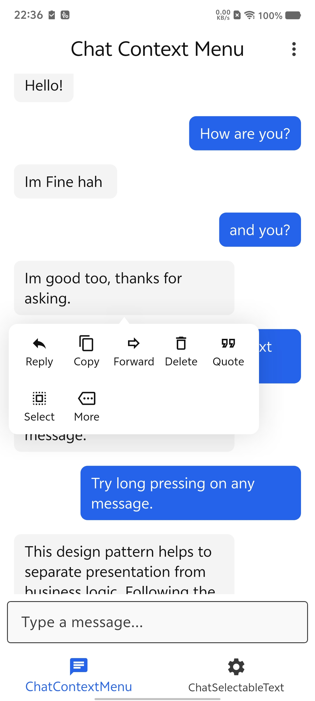
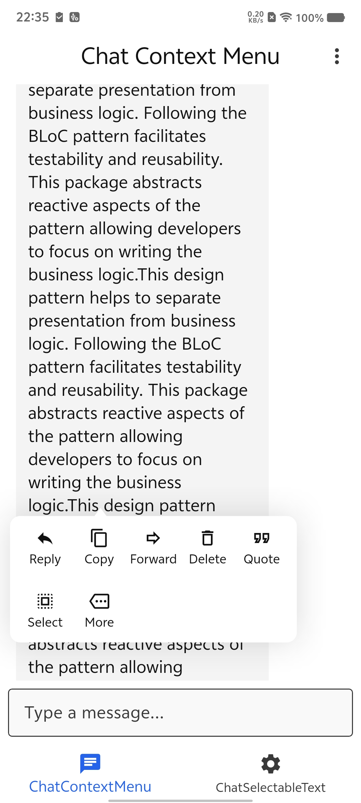
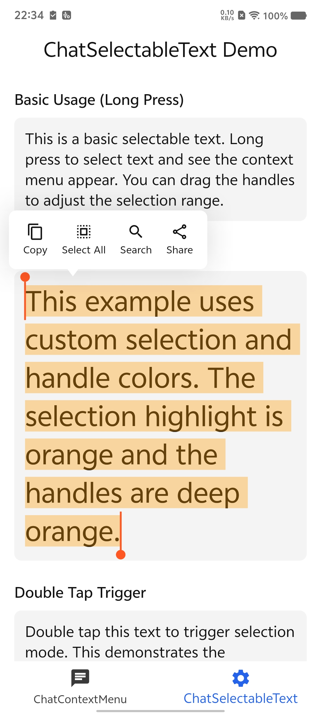

# Chat Context Menu

一个提供 iOS 风格聊天上下文菜单的 Flutter 组件包，支持自定义外观和动画。该组件包处理菜单定位、箭头指示器和背景遮罩，你只需提供任意 Widget 作为菜单内容。

## 功能特性

*   **iOS 风格上下文菜单：** 流畅的动画和布局，类似原生 iOS 上下文菜单。
*   **自动定位：** 菜单自动定位在目标组件附近，智能处理溢出情况。
*   **箭头指示器：** 可选的箭头指向目标组件。
*   **自定义外观：** 可配置背景颜色、圆角和遮罩颜色。
*   **灵活的内容：** 你提供菜单内容的 Widget，完全控制菜单项和布局。
*   **简单集成：** 使用 `ChatContextMenuWrapper` 包裹任意组件即可启用上下文菜单。
*   **可选文本：** `ChatSelectableText` 提供完全自定义的文本选择，支持拖动手柄、自动滚动和智能定位的上下文菜单，非常适合聊天气泡。支持长按、双击（选词）、三击（选段）、鼠标右键和桌面端鼠标拖动选择，菜单可垂直或水平排列（`axis`）。
*   **平台自适应触发：** `ChatContextMenuWrapper` 可配置移动端（单击 / 双击 / 长按）和桌面端（右键 / 左键）的触发方式。
*   **内置动画样式：** `ChatContextMenuAnimationStyle.scaleFade`（默认，现有整页淡入缩放）或 `cupertinoSheet`（从箭头回弹的 iOS 操作菜单）。可用 `transitionDurations` / `transitionDuration` 覆盖时长，或用 `transitionsBuilder` 完全自定义。
*   **遮罩锚点开孔（可选）：** 将 `excludeAnchorFromBarrier` 设为 `true` 且 `barrierColor` 非全透明时，遮罩在锚点处镂空，锚点保持明亮可点，点击半透明区域可关闭菜单；可用 `barrierAnchorPadding`、`barrierAnchorBorderRadius` 调整开孔。默认为 `false`，即传统整块半透明遮罩（锚点也会被压暗）。

## 截图

|                    ScreenShot                    |                    ScreenShot                    |         ScreenShot                    ｜         |
|:------------------------------------------------:|:------------------------------------------------:|:------------------------------------------------:|
|  |  |  |

## 开始使用

在 `pubspec.yaml` 中添加 `chat_context_menu`：

```yaml
dependencies:
  chat_context_menu: ^last_version
```

## Agent skills

本包随附面向 AI 编程助手的 Agent Skills，覆盖 `ChatContextMenuWrapper` 与 `ChatSelectableText`。在依赖了 `chat_context_menu` 的项目中安装：

```bash
dart run skills@ get
```

使用 `--all` 可跳过交互、安装全部 skill。说明见 [Ship skills with packages](https://dart.dev/tools/pub/package-skills)。

## 用法

使用 `ChatContextMenuWrapper` 包裹你想触发菜单的组件（通常是聊天气泡）。

```dart
import 'package:chat_context_menu/chat_context_menu.dart';
import 'package:example/app_theme.dart';
import 'package:example/context_menu_pane.dart';
import 'package:flutter/material.dart';

void main() {
  runApp(const MyApp());
}

class MyApp extends StatelessWidget {
  const MyApp({super.key});

  @override
  Widget build(BuildContext context) {
    return MaterialApp(
      title: 'Chat Context Menu',
      theme: AppTheme.light,
      darkTheme: AppTheme.dark,
      themeMode: .system,
      debugShowCheckedModeBanner: false,
      home: const ChatScreen(),
    );
  }
}

class ChatScreen extends StatefulWidget {
  const ChatScreen({super.key});

  @override
  State<ChatScreen> createState() => _ChatScreenState();
}

class _ChatScreenState extends State<ChatScreen> {
  final List<String> _messages = [
    "Hello!",
    "Hello!",
    "How are you?",
    "Im Fine",
    "and you?",
    "Im good too, thanks for asking.",
    "This is a long press context menu demo.",
    "Try long pressing on any message.",
    "Try long pressing on any message.",
    "You can see different options.",
    "You can see different options.",
    "Like Reply, Copy, Forward, Delete.",
    "It mimics the iOS style context menu.",
    "Hope",
    "It mimics the iOS style context menu.",
    "Hope",
    "Like Reply, Copy, Forward, Delete.",
  ];

  @override
  Widget build(BuildContext context) {
    final ThemeData theme = Theme.of(context);
    final TextTheme textTheme = theme.textTheme;
    final ColorScheme colorScheme = theme.colorScheme;

    return Scaffold(
      appBar: AppBar(title: const Text('Chat Context Menu')),
      body: Column(
        children: [
          Expanded(
            child: ListView.builder(
              padding: const EdgeInsets.all(16),
              itemCount: _messages.length,
              itemBuilder: (context, index) {
                final isMe = index % 2 == 0;
                return Padding(
                  padding: const EdgeInsets.symmetric(vertical: 4),
                  child: Align(
                    alignment: isMe
                        ? Alignment.centerRight
                        : Alignment.centerLeft,
                    child: ChatContextMenuWrapper(
                      barrierColor: Colors.transparent,
                      backgroundColor: colorScheme.surface,
                      borderRadius: BorderRadius.circular(10),
                      shadows: [
                        BoxShadow(
                          color: colorScheme.onSurface.withValues(alpha: 0.15),
                          blurRadius: 32,
                        ),
                      ],
                      menuBuilder: (context, hideMenu) {
                        return ContextMenuPane(
                          textTheme: textTheme,
                          colorScheme: colorScheme,
                          onReplayTap: hideMenu,
                          onForwardTap: hideMenu,
                          onCopyTap: hideMenu,
                          onDeleteTap: hideMenu,
                          onMoreTap: hideMenu,
                          onQuoteTap: hideMenu,
                          onSelectTap: hideMenu,
                        );
                      },
                      widgetBuilder: (context, showMenu, hideMenu) {
                        return GestureDetector(
                          onLongPress: showMenu,
                          child: Container(
                            padding: const EdgeInsets.symmetric(
                              horizontal: 12,
                              vertical: 8,
                            ),
                            margin: .symmetric(vertical: 4),
                            decoration: BoxDecoration(
                              color: isMe
                                  ? colorScheme.primary
                                  : colorScheme.surfaceContainerHighest,
                              borderRadius: BorderRadius.circular(8),
                            ),
                            child: Text(
                              _messages[index],
                              style: TextStyle(
                                fontSize: 16,
                                color: isMe ? colorScheme.onPrimary : null,
                              ),
                            ),
                          ),
                        );
                      },
                    ),
                  ),
                );
              },
            ),
          ),
          Padding(
            padding: const EdgeInsets.all(8.0),
            child: TextField(
              decoration: const InputDecoration(
                hintText: 'Type a message...',
                border: OutlineInputBorder(),
              ),
            ),
          ),
        ],
      ),
      bottomNavigationBar: BottomNavigationBar(
        items: const [
          BottomNavigationBarItem(icon: Icon(Icons.chat), label: 'Chat'),
          BottomNavigationBarItem(
            icon: Icon(Icons.settings),
            label: 'Settings',
          ),
        ],
      ),
    );
  }
}


```

## 自定义

你可以通过以下属性自定义 `ChatContextMenuWrapper`：

*   `widgetBuilder`：锚点组件的构建函数，提供 `showMenu` 与 `hideMenu` 回调（菜单未打开时调用 `hideMenu` 无效果）。
*   `menuBuilder`：返回菜单内容 Widget 的构建函数，提供 `hideMenu` 回调。
*   `barrierColor`：背景遮罩颜色。
*   `excludeAnchorFromBarrier`：为 `true` 时遮罩在锚点上镂空（见下文「使用与注意事项」）；默认 `false`，锚点与整屏一同被遮罩压暗（与常规 `ModalRoute` 一致）。
*   `barrierAnchorPadding`：在测得的锚点矩形四周增加/缩减开孔用的 `EdgeInsets`。
*   `barrierAnchorBorderRadius`：可选；与气泡 `BoxDecoration` 一致的圆角，用于开孔形状与半透明区外点击-dismiss 的区域判定。
*   `backgroundColor`：菜单容器的背景颜色。
*   `borderRadius`：菜单容器的圆角。
*   `padding`：菜单容器的内边距。
*   `animationStyle`：内置菜单动画。默认 `ChatContextMenuAnimationStyle.scaleFade`（150ms 整页淡入缩放）。`cupertinoSheet` 为 iOS 操作菜单回弹（335ms，从箭头放大）。非空的 `transitionsBuilder` 会覆盖两种内置样式。
*   `transitionDurations`：可选时长覆盖。为 `null` 时使用 `animationStyle` 的默认时长。
*   `barrierDismissible`：为 `true`（默认）时点遮罩暗区会尝试 `Navigator.maybePop` 关闭菜单；为 `false` 时播放系统提示音且不关闭（与 Flutter `ModalBarrier` 语义一致）。
*   `useRootNavigator`：为 `true` 时把菜单路由推到**根** `Navigator` 而不是最近的 Navigator，默认 `false`。见下文「嵌套 Navigator / 桌面多栏布局」。

## 使用与注意事项

**带锚点开孔的遮罩（聊天气泡推荐）**

* 将 `barrierColor` 设为非全透明，并显式设置 **`excludeAnchorFromBarrier: true`**。遮罩会在锚点位置**镂空**，并在路由页内增加全屏 dismiss 层，使点击**半透明区域**能稳定关闭菜单（开孔几何同时用于绘制与命中判定）。
* 将 `barrierAnchorBorderRadius` 与气泡 `BoxDecoration.borderRadius` 对齐，否则开孔轮廓与气泡圆角不一致。
* 若需要微调开孔相对锚点的大小，可使用 `barrierAnchorPadding`。

**列表内超长内容**

* 仅在 **`excludeAnchorFromBarrier: true`** 时：`ListView` 等列表中的高气泡仍可能按**全文高度**参与布局；本包在打开菜单前会将锚点全局矩形与**最近滚动视口**（`RenderAbstractViewport`）及 `MediaQuery` 范围求交，避免开孔向下“透”到输入框、底栏等区域。若使用嵌套滚动、自定义视口等特殊结构，请在实际页面中检查效果。

**默认无开孔**

* **`excludeAnchorFromBarrier: false`（默认）** 时为常规模态遮罩：锚点与背景一并被压暗，无镂空、无开孔专用的 in-route dismiss 层。

**包裹范围**

* `ChatContextMenuWrapper` 以包住 `widgetBuilder` 的**整颗**子树尺寸作为锚点。若使用开孔，且只希望小气泡作为锚点，勿在外层包过大容器，以免开孔范围过大。

**嵌套 Navigator / 桌面多栏布局**

* 锚点坐标始终换算到**目标 Navigator 的 Overlay 坐标系**，因此即使锚点位于被 `Transform` 平移、外层有留白壳层的嵌套 `Navigator` 内，菜单也能正确定位。单个全窗 Navigator（常见移动端）时 Overlay 原点即窗口原点，行为不变。
* 若最近 Navigator 的 Overlay 被**裁剪**（如桌面分栏布局：每栏各自的 Navigator 被 `ClipRect` / 裁剪的 `Material` 卡片包裹），请传 **`useRootNavigator: true`**，菜单与遮罩会渲染在根 Overlay 中、覆盖整个窗口、不被栏边界切断。`ChatSelectableText` 对应使用 **`useRootOverlay: true`**。
* `excludeAnchorFromBarrier: true` 时，开孔还会与锚点到 Overlay 之间的所有裁剪祖先（滚动视口、`ClipRect`/`ClipRRect`、裁剪的 `Material`）求交，保证洞不越出气泡所在栏的可见区域。
* 栏滑动动画进行中触发菜单时，锚点位置按触发瞬间快照；菜单不会跟随动画，但保持一致且可正常关闭。

## ChatSelectableText

一个从底层完全自定义实现的可选择文本组件。用户可以长按激活选择，通过拖动手柄调整选区范围，并对选中的文本执行操作。在桌面端还支持鼠标操作：按住左键拖动选择、右键打开菜单、双击选中单词、三击选中整段。

### 基础用法

```dart
ChatSelectableText(
  '长按选择文本并查看上下文菜单。',
  style: TextStyle(fontSize: 16),
  menuBackgroundColor: Colors.white,
  menuShadows: [
    BoxShadow(color: Colors.black12, blurRadius: 32),
  ],
  menuBuilder: (context, selectedText, hideMenu, selectAll) {
    return Row(
      mainAxisSize: MainAxisSize.min,
      children: [
        IconButton(
          icon: Icon(Icons.copy),
          onPressed: () {
            Clipboard.setData(ClipboardData(text: selectedText));
            hideMenu();
          },
        ),
        IconButton(
          icon: Icon(Icons.select_all),
          onPressed: selectAll,
        ),
      ],
    );
  },
)
```

### 自定义选中颜色

```dart
ChatSelectableText(
  '自定义选中区域和手柄颜色。',
  style: TextStyle(fontSize: 16),
  selectionColor: Colors.orange.withValues(alpha: 0.35),
  handleColor: Colors.deepOrange,
  menuBackgroundColor: Colors.white,
  menuBuilder: (context, selectedText, hideMenu, selectAll) {
    return Text('选中: $selectedText');
  },
)
```

### 在聊天气泡中使用

```dart
ChatSelectableText(
  message.text,
  style: TextStyle(
    fontSize: 16,
    color: isMe ? Colors.white : Colors.black,
  ),
  selectionColor: isMe
      ? Colors.white.withValues(alpha: 0.3)
      : Colors.blue.withValues(alpha: 0.3),
  handleColor: isMe ? Colors.white : Colors.blue,
  menuBackgroundColor: Colors.white,
  menuShadows: [
    BoxShadow(color: Colors.black12, blurRadius: 32),
  ],
  menuBuilder: (context, selectedText, hideMenu, selectAll) {
    return Row(
      mainAxisSize: MainAxisSize.min,
      children: [
        TextButton(onPressed: () { hideMenu(); }, child: Text('复制')),
        TextButton(onPressed: selectAll, child: Text('全选')),
      ],
    );
  },
  onSelectionChanged: (text) {
    debugPrint('选中: $text');
  },
)
```

### 单词选择模式

```dart
// 长按只选中按压的单词，而非全部文本
ChatSelectableText(
  '长按一个单词只选择该单词。',
  selectAllOnActivate: false,
  menuBuilder: (context, selectedText, hideMenu, selectAll) {
    return Row(
      mainAxisSize: MainAxisSize.min,
      children: [
        TextButton(onPressed: () { hideMenu(); }, child: Text('复制')),
        TextButton(onPressed: selectAll, child: Text('全选')),
      ],
    );
  },
)
```

### 桌面端交互与菜单排列方向

在桌面平台上，`ChatSelectableText` 开箱即支持鼠标操作：

*   **鼠标拖动** —— 按住左键拖动选择文本，松开后显示菜单；触摸拖动不受影响，仍可正常滚动列表。
*   **鼠标右键** —— 激活选择（遵循 `selectAllOnActivate`）并在指针位置打开菜单。
*   **双击 / 三击** —— 选中指针下的单词 / 整个段落（以换行符为边界）。

使用 `axis` 可以让菜单显示在选区左右两侧，而非上下方：

```dart
ChatSelectableText(
  '拖动、右键、双击或三击试试。',
  axis: Axis.horizontal, // 菜单显示在选区左侧/右侧
  menuBuilder: (context, selectedText, hideMenu, selectAll) {
    return Column(
      mainAxisSize: MainAxisSize.min,
      children: [
        TextButton(onPressed: () { hideMenu(); }, child: Text('复制')),
        TextButton(onPressed: selectAll, child: Text('全选')),
      ],
    );
  },
)
```

### ChatSelectableText 属性

| 属性                   | 类型                                                                | 默认值                     | 说明                                                            |
|------------------------|---------------------------------------------------------------------|----------------------------|-----------------------------------------------------------------|
| `data`                 | `String`                                                            | 必填                       | 文本内容                                                        |
| `style`                | `TextStyle?`                                                        | `null`                     | 文本样式                                                        |
| `selectionColor`       | `Color?`                                                            | 主题色 (30% 透明度)        | 选中高亮颜色                                                    |
| `handleColor`          | `Color?`                                                            | 主题色                     | 拖动手柄颜色                                                    |
| `handleSize`           | `double`                                                            | `16.0`                     | 手柄大小                                                        |
| `selectAllOnActivate`  | `bool`                                                              | `true`                     | 激活时全选文本，或只选按压的单词                                |
| `autoScrollEdgeExtent` | `double`                                                            | `48.0`                     | 触发自动滚动的边缘距离                                          |
| `autoScrollSpeed`      | `double`                                                            | `10.0`                     | 自动滚动速度（每帧像素数）                                      |
| `enableHapticFeedback` | `bool`                                                              | `true`                     | 激活选择时是否触发触感反馈                                      |
| `menuBuilder`          | `Widget Function(BuildContext, String, VoidCallback, VoidCallback)` | 必填                       | 菜单构建函数（上下文、文本、隐藏、全选）                        |
| `menuBackgroundColor`  | `Color?`                                                            | `null`                     | 菜单背景颜色                                                    |
| `menuBorderRadius`     | `BorderRadius`                                                      | `BorderRadius.circular(8)` | 菜单圆角                                                        |
| `menuPadding`          | `EdgeInsets`                                                        | `EdgeInsets.all(8)`        | 菜单内边距                                                      |
| `menuShadows`          | `List<BoxShadow>?`                                                  | `null`                     | 菜单阴影                                                        |
| `arrowHeight`          | `double`                                                            | `8.0`                      | 箭头指示器高度                                                  |
| `arrowWidth`           | `double`                                                            | `12.0`                     | 箭头指示器宽度                                                  |
| `spacing`              | `double`                                                            | `6.0`                      | 菜单与选区的间距                                                |
| `horizontalMargin`     | `double`                                                            | `10.0`                     | 距屏幕边缘最小留白                                              |
| `axis`                 | `Axis`                                                              | `Axis.vertical`            | 菜单排列方向：选区上下方（`vertical`）或左右侧（`horizontal`）  |
| `useRootOverlay`       | `bool`                                                              | `false`                    | 手柄/菜单/遮罩插入根 Overlay（嵌套 Navigator 场景，见上文说明） |
| `onSelectionChanged`   | `ValueChanged<String>?`                                             | `null`                     | 选中文本变化回调                                                |
| `onMenuClosed`         | `VoidCallback?`                                                     | `null`                     | 菜单关闭回调                                                    |
| `animationStyle`       | `ChatContextMenuAnimationStyle`                                     | `scaleFade`                | 内置菜单动画（`scaleFade` 或 `cupertinoSheet`）                 |
| `transitionsBuilder`   | `Function?`                                                         | `null`                     | 自定义菜单动画（覆盖 `animationStyle`）                         |
| `transitionDuration`   | `Duration?`                                                         | 样式默认                   | 菜单动画时长（`scaleFade` 150ms，`cupertinoSheet` 335ms）       |

## 更多信息

更多详情请查看仓库中的 `example` 文件夹。
